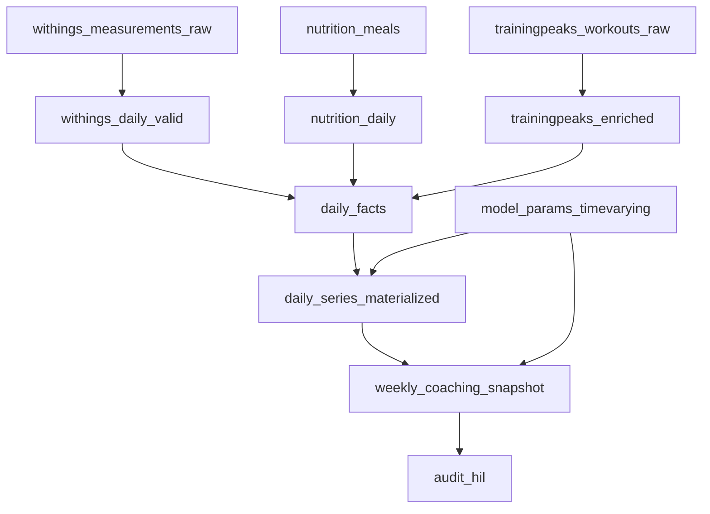

# Database Schema Documentation

This document provides comprehensive documentation of the Health Agentic Workflow MVP database schema.

## 📋 Overview

**Configuration**: Database connection via DATABASE_URL environment variable (see .env.example)

The schema is designed to support a health coaching workflow with:
- **Data ingestion** from multiple sources (Withings, MyFitnessPal, TrainingPeaks)
- **Parameter versioning** for reproducible model calculations
- **Materialized daily series** for fast UI queries
- **Immutable weekly snapshots** for coaching decisions
- **Audit trails** for human-in-the-loop decisions

## 🗂️ Schema Structure

### Core Data Sources
- `withings_measurements_raw` - Raw Withings scale measurements
- `nutrition_meals` - MyFitnessPal meal data
- `trainingpeaks_workouts_raw` - TrainingPeaks workout data

### Health Auto Export (HAE)
- `hae_raw` - Raw JSON exports from HAE
- `hae_metrics_parsed` - Parsed metrics by date

### Core Data Surface
- `daily_facts` - Canonical daily facts surface (CURRENT)

### Coaching & Parameters
- `model_params_timevarying` - Versioned model parameters
- `daily_series_materialized` - Computed daily series
- `weekly_coaching_snapshot` - Immutable weekly reviews
- `performance_goals` - Forward-looking goals
- `audit_hil` - Human-in-the-loop decision log

### Supporting Views
- `facts_intake_dow_medians` - Day-of-week intake imputation
- `withings_daily_valid` - Validated daily fat mass
- `nutrition_daily` - Daily nutrition aggregates

## 🔗 Key Relationships



## 📊 Data Flow

1. **Raw Data Ingestion**: CSV files → raw tables, HAE JSON → hae_raw
2. **Daily Aggregation**: Raw data → daily facts
3. **Parameter Application**: Daily facts + parameters → materialized series
4. **Weekly Snapshot**: Materialized series → immutable snapshots
5. **Human Review**: Snapshots → audit decisions

## 🔧 Key Tables

### `daily_facts`
Central fact table containing daily health metrics:
- `fact_date` - Primary key
- `intake_kcal` - Daily calorie intake
- `workout_kcal` - Daily exercise calories
- `fat_mass_kg` - Daily fat mass measurement
- `intake_is_imputed` - Flag for imputed data
- `imputation_method` - Method used for imputation

### `model_params_timevarying`
Versioned model parameters:
- `params_version` - Version identifier
- `effective_start_date` / `effective_end_date` - Validity period
- `c_exercise_comp` - Exercise compensation factor [0,1]
- `alpha_fm` / `alpha_lbm` - EMA smoothing parameters
- `bmr0_kcal` / `k_lbm_kcal_per_kg` - BMR calculation parameters

### `daily_series_materialized`
Computed daily series for UI:
- `fat_mass_ema_kg` - EMA-smoothed fat mass
- `lbm_ema_kg_for_bmr` - LBM for BMR calculation
- `bmr_kcal` - Computed basal metabolic rate
- `adj_exercise_kcal` - Adjusted exercise calories
- `net_kcal` - Net calorie balance

### `weekly_coaching_snapshot`
Immutable weekly coaching decisions:
- `week_start` / `week_end` - Week boundaries
- `predicted_delta_fm_kg` - Predicted fat mass change
- `observed_delta_fm_kg` - Actual fat mass change
- `decision` - Coaching decision (Approve/Within Noise/Investigate)

## 🎯 Business Rules

### Data Quality
- Fat mass range: 20-60 kg (realistic for adult males)
- Intake calories: 500-6000 kcal/day
- Exercise calories: 0-8000 kcal/day
- Parameter constraints enforced via CHECK constraints

### Imputation
- Missing intake data imputed using day-of-week medians
- Imputation flags track data quality
- Consistency enforced via contracts

### Versioning
- Parameters versioned with effective dates
- Materialized series tagged with parameter version
- Weekly snapshots immutable once created

## 🔍 Query Patterns

### Common Queries
```sql
-- Get current parameter version
SELECT * FROM model_params_timevarying 
WHERE effective_start_date <= CURRENT_DATE 
  AND (effective_end_date IS NULL OR effective_end_date >= CURRENT_DATE);

-- Get recent daily series
SELECT * FROM daily_series_materialized 
WHERE fact_date >= CURRENT_DATE - INTERVAL '30 days'
ORDER BY fact_date DESC;

-- Get weekly snapshots with decisions
SELECT week_start, decision, predicted_delta_fm_kg, observed_delta_fm_kg
FROM weekly_coaching_snapshot 
WHERE decision != 'Approve'
ORDER BY week_start DESC;
```

## 🚀 Performance Considerations

- **Indexes**: Added on common query columns (dates, parameters, decisions)
- **Materialized Views**: Daily series pre-computed for UI speed
- **Partitioning**: Consider partitioning daily_series_materialized by year
- **Constraints**: Foreign keys ensure referential integrity

## 📝 Schema Manifest

The complete schema definition is maintained in `schema.manifest.yaml` with:
- Table/view definitions
- Column specifications
- Data quality tests
- Usage patterns
- Contracts for validation

## 🔄 Migration Strategy

Schema changes are managed via SQL migrations in `sql/migrations/`:
- Versioned by date and sequence
- Include rollback instructions
- Tested before deployment
- Documented in CHANGELOG.md
